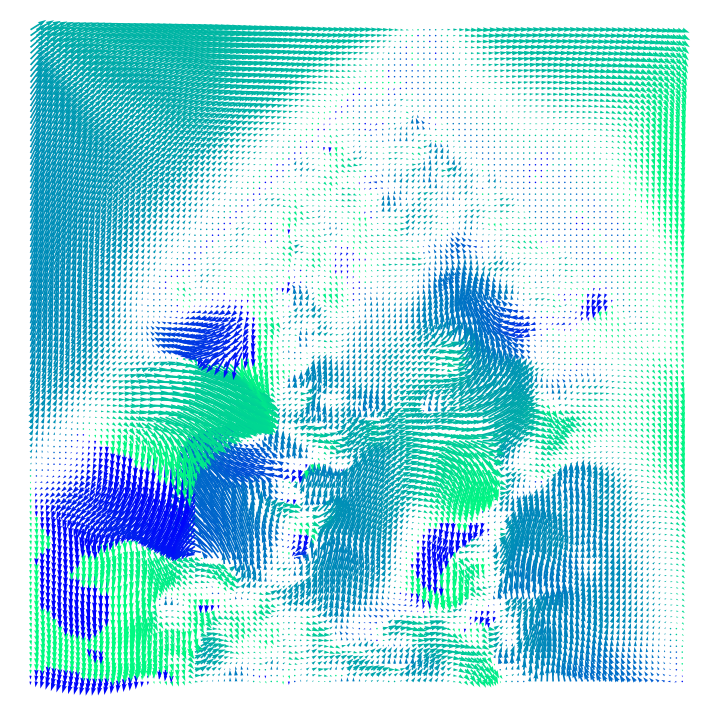

# Evaluations-for-image-registration
Quantitative evaluation for image registration.

- Dice
- NegJDetNum (2D/3D)
- SSIM(2D/3D)
- Mutual Information / local mutual information
- NCC

# Visualization
To visualize the DVF like this 

- unzip visualization/neurite.zip
- then "cd neurite && python setup.py install"
